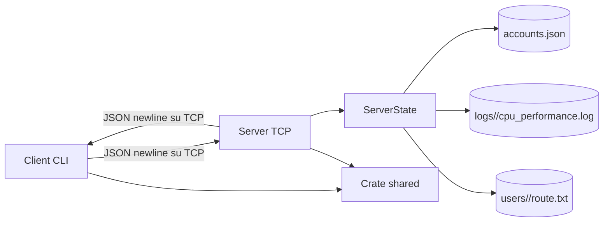

# GeoRust - Manuale del progettista

## 1. Scopo del documento

Questo documento descrive l'architettura tecnica di GeoRust, le responsabilita dei moduli, i flussi principali e le scelte implementative. Il manuale utente descrive invece l'avvio e l'utilizzo dell'applicazione.

Il progetto e organizzato come workspace Cargo composto da tre crate:

- `shared`: tipi e funzioni comuni a client e server;
- `server`: autenticazione, gestione utenti, ricezione dati, messaggistica e analytics;
- `client`: interfaccia terminale, simulazione del percorso e comunicazione con il server.

## 2. Architettura generale



Il server ascolta su `127.0.0.1:8080`. Ogni client stabilisce una connessione TCP e usa lo stesso canale per:

- registrazione e login;
- invio delle coordinate;
- richieste di analytics;
- messaggi diretti e broadcast;
- ricezione delle risposte e dei messaggi in ingresso.

La comunicazione applicativa è basata su JSON. Ogni pacchetto è serializzato su una riga terminata da `\\n`; il ricevitore legge il socket riga per riga e deserializza il contenuto.

## 3. Struttura del workspace

```text
project/
|-- Cargo.toml
|-- documentation/
    |-- manuale_utente.md
    |-- manuale_progettista.md
    |-- presentation.pptx
|-- code/
    |-- shared/
    |   |-- Cargo.toml
    |   `-- src/
    |       |-- lib.rs
    |       |-- messages.rs
    |       |-- coordinates.rs
    |       |-- update_position.rs
    |       `-- user_state.rs
    |-- server/
    |   |-- Cargo.toml
    |   |-- data/accounts.json
    |   |-- src/
    |   |   |-- main.rs
    |   |   |-- server_state.rs
    |   |   |-- auth.rs
    |   |   |-- analytics.rs
    |   |   |-- tracker_state.rs
    |   |   `-- client_handler.rs
    |   `-- tests/
    `-- client/
        |-- Cargo.toml
        |-- src/
        |   |-- main.rs
        |   |-- auth_flow.rs
        |   |-- menu.rs
        |   |-- path_manager.rs
        |   |-- utils.rs
        |   `-- users/
        `-- tests/
```

## 4. Crate `shared`

### `shared/src/messages.rs`

Definisce il protocollo applicativo tramite gli enum serializzabili:

- `Register` e `Login` per l'autenticazione;
- `RegisterOk`, `RegisterErr`, `LoginOk`, `LoginErr` per le risposte;
- `SendDirectMessage` e `IncomingDirectMessage` per la messaggistica privata;
- `SendBroadcastMessage` e `IncomingBroadcastMessage` per la messaggistica globale;
- `AnalyticsRequest`, `AnalyticsResponse` e `AnalyticsErr` per le statistiche;
- `AnalyticsField` per il tipo di statistica richiesta;
- `AnalyticsPeriodMessage` per il periodo temporale.

Il tipo `Message` è il contratto comune tra client e server. Una modifica ai suoi variant richiede il controllo di entrambi i crate.

### `shared/src/coordinates.rs`

Contiene `Coordinates`, che rappresenta latitudine, longitudine e timestamp Unix. I campi sono privati e l'accesso avviene tramite:

- `Coordinates::new(...)` per la costruzione;
- `get_latitude()`;
- `get_longitude()`;
- `get_timestamp()`.

### `shared/src/update_position.rs`

Definisce `UpdatePosition`, il pacchetto usato per inviare una posizione:

- username;
- coordinates;
- data/ora UTC.

### `shared/src/lib.rs`

Fornisce le funzioni comuni:

- `parse_values`, per separare le colonne di una riga di percorso;
- `send_packet`, per serializzare un valore e inviarlo come riga JSON su un writer asincrono;
- `read_file`, per l'apertura asincrona dei file.

## 5. Server

### 5.1 Avvio: `server/src/main.rs`

`main` avvia il runtime Tokio e:

1. avvia il monitoraggio del consumo CPU;
2. crea il `ServerState`;
3. carica gli account dal file JSON;
4. crea un `TcpListener` su `127.0.0.1:8080`;
5. accetta connessioni in un ciclo infinito;
6. crea un task Tokio per ogni client.
7. gestisce e salva le coordinate ricevute da ogni client autenticato.


Lo stato condiviso è un `Arc<ServerState>`, clonato e passato ai task delle connessioni. I campi mutabili di `ServerState` (`connections`, `accounts` e `users`) sono protetti individualmente da `tokio::sync::RwLock`: più task possono effettuare letture simultanee, mentre una scrittura acquisisce l'accesso esclusivo al campo interessato. `Arc` gestisce la proprietà condivisa dello stato, mentre i singoli `RwLock` garantiscono la sincronizzazione asincrona delle mappe.

### 5.2 Stato applicativo: `server/src/server_state.rs`

`ServerState` mantiene:

- `connections`: username associato al canale di uscita del client connesso;
- `accounts`: username e password hashata;
- `users`: username associato a `TrackerState`;
- percorso del file degli account.

Responsabilita principali:

- registrazione e autenticazione, tramite i metodi definiti in `auth.rs`;
- registrazione della sessione attiva con `try_login`;
- rimozione della sessione con `logout`;
- invio diretto e broadcast tramite canali `mpsc`;
- caricamento e salvataggio dello storico delle posizioni;
- elaborazione dei pacchetti di posizione;
- monitoraggio e scrittura dei dati di utilizzo CPU.

Gli account sono serializzati in `server/data/accounts.json`. Lo storico di un utente viene salvato nell'area dati del server associata a quell'utente.

### 5.3 Autenticazione: `server/src/auth.rs`

Il modulo estende `ServerState` con:

- `register`;
- `authenticate`.

Le regole implementate sono:

- username tra 3 e 20 caratteri;
- caratteri ammessi: ASCII alfanumerici, `_` e `-`;
- password di almeno 6 caratteri;
- username case-sensitive;
- password memorizzate tramite bcrypt con salt casuale;
- errori rappresentati da `AuthError`.

Il salvataggio degli account avviene dopo una registrazione riuscita. Il login verifica l'hash tramite bcrypt e impedisce sessioni contemporanee dello stesso username.

### 5.4 Gestione della connessione: `server/src/client_handler.rs`

`handle_client` rappresenta il ciclo di vita di una connessione:

```text
TCP accept
   |
   v
authenticate_client
   |
   +-- Register -> valida -> applica hash -> salva -> risposta
   |
   +-- Login -> verifica -> registra sessione -> carica storico
   |
   v
setup_active_session
   |
   +-- task di invio messaggi dal server al client
   |
   v
process_client_messages
   |
   +-- AnalyticsRequest
   +-- SendDirectMessage
   +-- SendBroadcastMessage
   +-- UpdatePosition
   |
   v
disconnect_client
```

Il server usa due direzioni logiche indipendenti:

- il task principale legge i messaggi dal client;
- un task separato riceve da un canale `mpsc` i messaggi destinati al client e li scrive sul socket.

Questa separazione permette di ricevere messaggi asincroni mentre il client sta aspettando input o sta inviando coordinate.

### 5.5 Stato del veicolo: `server/src/tracker_state.rs`

`TrackerState` rappresenta lo stato corrente di un utente monitorato:

- ultima coordinata;
- stato (`Sconnesso`, `Fermo`, `InMovimento`);
- ultima informazione di movimento;
- storico degli `UpdatePosition`;
- soglie per movimento e pausa.

Quando arriva una nuova posizione, `update_position` confronta la nuova coordinata con la precedente e aggiorna lo stato del veicolo. La distanza geografica viene calcolata usando la funzione haversine presente nel modulo analytics.

### 5.6 Analytics: `server/src/analytics.rs`

`analyze_movement` riceve:

- lo storico delle coordinate;
- un `AnalysisPeriod`;
- un `AnalyticsConfig`.

Il flusso è:

1. risoluzione dell'intervallo temporale;
2. filtro delle coordinate nell'intervallo;
3. ordinamento per timestamp;
4. calcolo della distanza tramite haversine;
5. distinzione tra movimento e sosta usando `movement_threshold_meters`;
6. accumulo di `movement_duration` e `pause_duration`;
7. calcolo della velocita media in km/h.

I periodi supportati sono:

- storico completo tramite intervallo custom;
- giorno corrente;
- settimana corrente;
- mese corrente;
- intervallo custom con timestamp Unix.

La configurazione predefinita considera movimento oltre 1 metro e pausa solo dopo almeno 180 secondi di immobilità.

## 6. Client

### 6.1 Avvio e ciclo principale: `client/src/main.rs`

Il client esegue un ciclo di sessione:

1. connessione al server;
2. registrazione/login;
3. preparazione di `client/users/<username>/route.txt`;
4. separazione del socket TCP in lettura e scrittura;
5. avvio dei task di lettura, scrittura e invio coordinate;
6. esecuzione del menu principale;
7. abort dei task e ritorno al menu iniziale al logout.

### 6.2 Autenticazione: `client/src/auth_flow.rs`

Gestisce il menu iniziale e traduce le scelte dell'utente in messaggi `Message`:

- legge username e password;
- usa `rpassword` per non mostrare la password;
- invia `Register` o `Login`;
- interpreta le risposte del server;
- restituisce lo username dopo un login riuscito.

### 6.3 Percorso simulato: `client/src/path_manager.rs`

Il modulo crea e aggiorna il file `route.txt`.

Quando deve generare una posizione:

1. sceglie un punto iniziale nell'area geografica configurata;
2. riusa l'ultima posizione, se disponibile;
3. con probabilità del 15% genera una sosta;
4. altrimenti sceglie una distanza casuale fino a 200 metri;
5. sceglie una direzione casuale;
6. calcola la nuova coordinata con una formula geografica;
7. aggiunge al file latitudine, longitudine e timestamp;
8. restituisce un `UpdatePosition` pronto per l'invio.

### 6.4 Task e canali: `client/src/utils.rs`

Il client usa task Tokio distinti:

```text
socket read half  -> spawn_reader_task  -> stampa messaggi ricevuti
socket write half <- spawn_writer_task <- canale mpsc<Outgoing>
                                         ^
                                         |
                         menu + position task
```

`Outgoing` distingue:

- `Chat(Message)` per richieste applicative;
- `Position(UpdatePosition)` per le coordinate.

`spawn_position_task` aspetta 30 secondi tra due invii, genera/aggiunge una posizione e la passa al writer tramite il canale.

`spawn_reader_task` riconosce e stampa:

- messaggi diretti;
- broadcast;
- risposte analytics;
- errori analytics.

### 6.5 Menu: `client/src/menu.rs`

Il menu costruisce richieste, ma non esegue i calcoli analytics. Per ogni richiesta:

1. seleziona il campo (`Path`, `TotalDistance`, `AverageSpeed`, `MovementDuration`, `PauseDuration` o `All`);
2. seleziona il periodo;
3. converte eventuali date locali in timestamp Unix;
4. invia `AnalyticsRequest` al server.

Il menu gestisce anche l'invio di messaggi diretti e broadcast e restituisce `MenuAction::Logout` quando l'utente chiude la sessione.

## 7. Flussi principali

### 7.1 Registrazione

```text
Client auth_flow
  -> Message::Register
  -> TCP newline-delimited JSON
Server client_handler
  -> ServerState::register
  -> bcrypt hash
  -> accounts.json
  -> Message::RegisterOk / RegisterErr
```

### 7.2 Login

```text
Client
  -> Message::Login
Server
  -> verifica bcrypt
  -> ServerState::try_login
  -> carica storico utente
  -> crea canale mpsc di uscita
  -> Message::LoginOk
Client
  -> avvia task lettura, scrittura e posizione
```

### 7.3 Posizione

```text
route.txt
  -> path_manager genera una riga
  -> spawn_position_task crea UpdatePosition
  -> mpsc::Sender<Outgoing>
  -> spawn_writer_task
  -> TCP
  -> client_handler
  -> ServerState::process_packet
  -> storico in memoria e su file
```

### 7.4 Analytics

```text
menu client
  -> AnalyticsRequest(field, period)
  -> client_handler
  -> caricamento storico dello user
  -> analytics::analyze_movement
  -> selezione del campo richiesto
  -> AnalyticsResponse
  -> reader task del client
```

### 7.5 Messaggistica

Per un messaggio diretto il server cerca il destinatario in `connections` e invia sul suo canale `mpsc`. Per un broadcast il server percorre le connessioni attive e invia lo stesso evento a ciascun destinatario.

## 8. Scelte implementative

### Tokio e asincronia

Tokio gestisce runtime, socket TCP, file, timer, task e canali. Le operazioni lente o concorrenti non bloccano il ciclo principale del server o del client.

### `Arc<ServerState>` e `RwLock`

Lo stato del server è condiviso tra i task che gestiscono i client tramite `Arc`. `ServerState` non è racchiuso in un mutex globale: le mappe `connections`, `accounts` e `users` contengono ciascuna un `tokio::sync::RwLock`. Le operazioni di sola lettura acquisiscono un read lock condivisibile, mentre registrazioni, logout, aggiornamenti dello storico e altre modifiche acquisiscono un write lock esclusivo sulla mappa interessata. Questo limita la contesa rispetto a un unico lock attorno all'intero stato.

### Canali `mpsc`

Ogni sessione dispone di un canale per consegnare al task di scrittura i messaggi da inviare al client. Questo evita che funzioni come broadcast e messaggistica debbano possedere direttamente il socket.

### JSON newline-delimited

Il formato è semplice da ispezionare e compatibile con lettura streaming. Il delimitatore newline consente di individuare i confini dei messaggi senza introdurre un framing binario.

### Bcrypt

Le password non vengono conservate in chiaro. Il salt e gestito dalla libreria bcrypt, per cui due password uguali producono hash diversi.

### Persistenza su file

Il progetto usa file JSON e file di testo invece di un database:

- semplice da configurare in locale;
- adatto a un progetto didattico;
- facilmente ispezionabile;
- con limiti su concorrenza, transazioni e scalabilita.

## 9. Test

I test sono in `server/tests/` e sono progettati per coprire:

- registrazione, validazione username, password e autenticazione;
- salvataggio/caricamento degli account;
- analytics e periodi temporali;
- transizioni di stato del tracker.
- performance CPU, traffico simulato e scrittura log.

I file in `tests/` sono integration test separati. Poiche il package server espone attualmente un binario e non una libreria, i test includono con `#[path = "../src/..."]` i moduli necessari. Questa soluzione permette a Cargo e Rust Analyzer di riconoscere i singoli file senza modificare i file applicativi.

Per eseguire un singolo file:

```powershell
cargo test --manifest-path project/code/server/Cargo.toml --test analytics_test
cargo test --manifest-path project/code/server/Cargo.toml --test auth_test
cargo test --manifest-path project/code/server/Cargo.toml --test tracker_state_transition_test
cargo test --manifest-path project/code/client/Cargo.toml --test performance_stress_test
```


## 10. Mappa rapida: cosa fa cosa

| Componente | Responsabilita |
|---|---|
| `shared/messages.rs` | Protocollo dei messaggi client-server |
| `shared/coordinates.rs` | Modello di una coordinata |
| `shared/update_position.rs` | Modello di una posizione con utente e tempo |
| `shared/lib.rs` | Serializzazione pacchetti e parsing comune |
| `server/main.rs` | Avvio server, listener TCP e task per client |
| `server/server_state.rs` | Stato globale, sessioni, storico e persistenza |
| `server/auth.rs` | Registrazione, hash e verifica password |
| `server/client_handler.rs` | Ciclo di vita e routing dei messaggi client |
| `server/tracker_state.rs` | Stato del veicolo e transizioni movimento/sosta |
| `server/analytics.rs` | Distanze, durate, pause, velocita e filtri temporali |
| `client/main.rs` | Ciclo di sessione del client |
| `client/auth_flow.rs` | Menu registrazione/login |
| `client/path_manager.rs` | Generazione e aggiornamento del percorso |
| `client/utils.rs` | Task asincroni, canale di uscita e I/O rete |
| `client/menu.rs` | Menu, richieste analytics e messaggi |
| `server/tests/*.rs` | Test funzionali dei moduli server |


## 11. Analisi delle Prestazioni del Server GeoRust


Il presente documento espone i risultati dei test prestazionali condotti sul server GeoRust. Sono stati effettuati 3 test incrementali su due sistemi operativi differenti (macOS e Linux Mint). Verranno mostrati l'utilizzo percentuale della CPU e la memoria RAM allocata.


### Ambiente 1: macOS (Apple Silicon M1, 16 GB RAM)

#### Caso d'uso: 10 Utenti
L'inizializzazione genera un picco isolato di CPU. A regime, il traffico di rete prodotto da 10 veicoli incide in maniera irrilevante sulle prestazioni del sistema.

```text
[2026-09-13 14:50:46] [PID: 10436] Server CPU usage: 0.010718 0.000275%
[2026-09-13 14:52:46] [PID: 10436] Server CPU usage: 2.510139 2.082851%
[2026-09-13 14:54:46] [PID: 10436] Server CPU usage: 2.575374 0.054363%
[2026-09-13 14:56:46] [PID: 10436] Server CPU usage: 2.649668 0.061912%
[2026-09-13 14:58:46] [PID: 10436] Server CPU usage: 2.712762 0.052578%
[2026-09-13 15:00:46] [PID: 10436] Server CPU usage: 2.773986 0.051020%
```

| Metrica | Valore Medio |
| :--- | :--- |
| Utilizzo CPU (%) | 0.384 |
| Memoria RAM (MB) | 7.900 |

#### Caso d'uso: 100 Utenti
L'autenticazione simultanea di 100 dispositivi consuma temporaneamente il 39.118% di CPU. Nelle finestre temporali successive, la gestione delle connessioni, il calcolo delle distanze e l'inoltro di broadcast richiedono uno sforzo minimo.

```text
[2026-09-13 15:05:18] [PID: 11713] Server CPU usage: 0.006826 0.000300%
[2026-09-13 15:07:18] [PID: 11713] Server CPU usage: 46.947939 39.117594%
[2026-09-13 15:09:18] [PID: 11713] Server CPU usage: 47.464265 0.430272%
[2026-09-13 15:11:18] [PID: 11713] Server CPU usage: 47.962144 0.414899%
[2026-09-13 15:13:18] [PID: 11713] Server CPU usage: 48.449576 0.406193%
[2026-09-13 15:15:18] [PID: 11713] Server CPU usage: 48.936215 0.405533%
```

| Metrica | Valore Medio |
| :--- | :--- |
| Utilizzo CPU (%) | 6.796 |
| Memoria RAM (MB) | 12.000 |

#### Caso d'uso: 1000 Utenti
Lo stress test scala il sistema a 1000 connessioni. Il calcolo parallelo su architettura multicore è visibile nel picco iniziale. La memoria si stabilizza a 118 MB, notevolmente maggiore rispetto ai casi precedenti, ma strettamente legato all'allocazione della memoria del sistema operativo.

```text
[2026-09-13 15:29:09] [PID: 13805] Server CPU usage: 0.014050 0.000521%
[2026-09-13 15:31:09] [PID: 13805] Server CPU usage: 116.851927 97.364897%
[2026-09-13 15:33:09] [PID: 13805] Server CPU usage: 383.874100 222.518478%
[2026-09-13 15:35:09] [PID: 13805] Server CPU usage: 392.191839 6.931449%
[2026-09-13 15:37:09] [PID: 13805] Server CPU usage: 400.727229 7.112825%
[2026-09-13 15:39:09] [PID: 13805] Server CPU usage: 408.955683 6.857045%
```

| Metrica | Valore Medio |
| :--- | :--- |
| Utilizzo CPU (%) | 56.798 |
| Memoria RAM (MB) | 118.000 |

### Ambiente 2: Linux (iMac late 2012 - 15 quad core - 24 GB RAM)

#### Caso d'uso: 10 Utenti
L'implementazione su Linux gestisce il traffico di piccola entità in modo speculare all'ambiente macOS, mantenendo i consumi a regime a livelli costanti.

```text
[2026-09-13 16:49:17] [PID: 7446] Server CPU usage: 0.004120 0.000870%
[2026-09-13 16:51:17] [PID: 7446] Server CPU usage: 0.004732 0.000510%
[2026-09-13 16:53:17] [PID: 7446] Server CPU usage: 0.005578 0.000705%
[2026-09-13 17:03:07] [PID: 7905] Server CPU usage: 0.004255 0.000940%
[2026-09-13 17:05:07] [PID: 7905] Server CPU usage: 2.922467 2.431844%
[2026-09-13 17:07:07] [PID: 7905] Server CPU usage: 2.950893 0.023688%
[2026-09-13 17:09:07] [PID: 7905] Server CPU usage: 2.977744 0.022376%
[2026-09-13 17:11:07] [PID: 7905] Server CPU usage: 3.006679 0.024112%
[2026-09-13 17:13:07] [PID: 7905] Server CPU usage: 3.034367 0.023073%
[2026-09-13 17:15:07] [PID: 7905] Server CPU usage: 3.057427 0.019217%
```

| Metrica | Valore Medio |
| :--- | :--- |
| Utilizzo CPU (%) | 0.255 |
| Memoria RAM (MB) | 4.000 |

#### Caso d'uso: 100 Utenti
Il consumo di RAM incrementa per conservare lo stato delle sessioni in memoria. Il processore gestisce la finestra di elaborazione di massa con un picco isolato, attestandosi stabilmente a uno 0.27% di utilizzo medio a regime.

```text
[2026-09-13 17:22:00] [PID: 10522] Server CPU usage: 0.004169 0.000900%
[2026-09-13 17:24:00] [PID: 10522] Server CPU usage: 28.090869 23.405583%
[2026-09-13 17:26:00] [PID: 10522] Server CPU usage: 28.419411 0.273785%
[2026-09-13 17:28:00] [PID: 10522] Server CPU usage: 28.733145 0.261445%
[2026-09-13 17:30:00] [PID: 10522] Server CPU usage: 29.059870 0.272271%
[2026-09-13 17:32:00] [PID: 10522] Server CPU usage: 29.383064 0.269328%
```

| Metrica | Valore Medio |
| :--- | :--- |
| Utilizzo CPU (%) | 4.081 |
| Memoria RAM (MB) | 6.000 |

#### Caso d'uso: 1000 Utenti
Il runtime su Linux alloca un blocco di memoria decisamente inferiore (30 MB) per il mantenimento dei socket aperti rispetto all'ambiente macOS. Le prestazioni si mantengono costanti nell'elaborazione delle richieste analitiche e nell'instradamento geografico in tempo reale.

```text
[2026-09-13 17:33:47] [PID: 12267] Server CPU usage: 0.004247 0.000881%
[2026-09-13 17:35:49] [PID: 12267] Server CPU usage: 228.467089 190.385702%
[2026-09-13 17:41:00] [PID: 13377] Server CPU usage: 0.004246 0.000943%
[2026-09-13 17:43:00] [PID: 13377] Server CPU usage: 282.989758 235.821260%
[2026-09-13 17:45:00] [PID: 13377] Server CPU usage: 295.409765 10.350006%
[2026-09-13 17:47:00] [PID: 13377] Server CPU usage: 307.475049 10.054403%
[2026-09-13 17:49:00] [PID: 13377] Server CPU usage: 319.565572 10.075435%
[2026-09-13 17:51:00] [PID: 13377] Server CPU usage: 332.330448 10.637397%
```

| Metrica | Valore Medio |
| :--- | :--- |
| Utilizzo CPU (%) | 58.416 |
| Memoria RAM (MB) | 30.000 |

### Conclusione

I test eseguiti mostrano che il server GeoRust mantiene un consumo contenuto di risorse nei carichi ridotti, mentre l'aumento del numero di utenti porta principalmente a una crescita dell'utilizzo della CPU. Il picco più significativo si verifica durante la fase iniziale di login simultaneo, mentre nelle fasi successive il carico tende a stabilizzarsi.

Nel confronto tra macOS e Linux, i valori di utilizzo della CPU risultano complessivamente comparabili nello scenario con 1000 utenti, mentre emergono differenze più evidenti nel consumo di memoria.

Nel complesso, i risultati confermano la capacità del server di gestire un numero crescente di connessioni mantenendo il consumo di memoria entro valori contenuti. Lo scenario con 1000 utenti rappresenta il punto di maggiore carico osservato e costituisce quindi il riferimento principale.